# Reliability Specification v0.1: Appointment Scheduling Agent

Scope: the appointment lifecycle state machine, with failure handling for timeout, conflict, partial success, duplicates, tool failure and patient changes.
Stack: LangGraph (orchestration), FastAPI (tools), SQLite (state), Langfuse (traces), pytest + YAML (evaluation).

## 0. Design principles

1. **The database is the source of truth, not the LLM.** The agent proposes transitions and the state machine validates them. The LLM never "decides" that something is booked.
2. **Three separate state layers.** Don't mix them.
   - *Conversation state* (LangGraph): what the agent has collected and said.
   - *Appointment state* (SQLite, this spec): the lifecycle.
   - *Side-effect state* (outbox): notification and calendar-sync status.
3. **Write-ahead intent.** Every mutating call is recorded as an `intent` with an idempotency key before it is sent.
4. **Unknown is a state.** A write that timed out is neither "failed" nor "succeeded". It is `RECONCILING`, and it is never blindly retried.
5. **Make-before-break.** The old booking is never released until the replacement is confirmed.
6. **Truthful reporting.** The agent may only assert what the DB state supports (invariant I3).
7. **Every non-terminal state has a way out.** That means a timeout, an escalation, or both.

## 1. States

| State | Kind | Meaning | Exit timeout |
|---|---|---|---|
| `COLLECTING` | active | Gathering patient identity, visit type, provider and time preferences | 30 min idle → `EXPIRED` |
| `SEARCHING` | transient | `search_slots` in flight | tool deadline → retry or `ESCALATED` |
| `OFFERED` | active | Slot options shown, waiting for the patient's choice | 30 min idle → `EXPIRED` |
| `HELD` | active | Tentative hold on a slot, with `hold_expires_at` (default 10 min) | hold TTL → `OFFERED` or `EXPIRED` |
| `CONFIRMING` | active | Asked "shall I book X?", waiting for an explicit yes | shares the hold TTL |
| `COMMITTING` | transient | `book_appointment` intent logged, call in flight | commit deadline → `RECONCILING` |
| `BOOKED` | stable | DB confirms the booking. Side effects may still be pending | reminder / no-show logic is out of scope |
| `MODIFYING` | active | Reschedule in progress. The old booking stays live (make-before-break) | saga timeout → compensate |
| `CANCELLING` | transient | `cancel_appointment` in flight | deadline → `RECONCILING` |
| `RECONCILING` | transient | Outcome of a write is unknown. Resolved by read-back | 3 reads or 60 s → `ESCALATED` |
| `CANCELLED` | terminal | Cancelled and confirmed | none |
| `EXPIRED` | terminal | Never booked (abandoned, or hold lapsed with no recovery) | none |
| `ESCALATED` | terminal for the agent | Handed to a human with a full context packet | human SLA (out of scope) |

`FAILED` is deliberately omitted. A failure always lands in `EXPIRED` (clean, nothing leaked) or `ESCALATED` (needs a human). That removes the ambiguous middle.

### Side-effect sub-status (orthogonal to the lifecycle)

`confirmation_notice ∈ {NOT_REQUIRED, PENDING, SENT, FAILED_RETRYING, FAILED_FINAL}`

`calendar_sync` uses the same values.

`BOOKED + notice FAILED_RETRYING` is the canonical **partial success**. It is a valid, stable state, not an error state.

```mermaid
flowchart LR
    START((start)) --> COLLECTING

    subgraph DISCOVER[" 1 · Discover "]
        direction LR
        COLLECTING["COLLECTING<br/><i>gather details</i>"]
        SEARCHING["SEARCHING<br/><i>find slots</i>"]
        OFFERED["OFFERED<br/><i>patient chooses</i>"]
        COLLECTING -->|fields complete| SEARCHING
        SEARCHING -->|slots found| OFFERED
        SEARCHING -->|no slots, widen| COLLECTING
        OFFERED -->|preferences change| SEARCHING
    end

    subgraph COMMIT[" 2 · Commit "]
        direction LR
        HELD["HELD<br/><i>slot on hold</i>"]
        CONFIRMING["CONFIRMING<br/><i>awaiting yes</i>"]
        COMMITTING["COMMITTING<br/><i>write in flight</i>"]
        HELD -->|hold acquired| CONFIRMING
        CONFIRMING -->|explicit yes| COMMITTING
    end

    subgraph LIVE[" 3 · Live booking "]
        direction LR
        BOOKED["BOOKED"]
        MODIFYING["MODIFYING<br/><i>reschedule</i>"]
        CANCELLING["CANCELLING"]
        BOOKED -->|reschedule| MODIFYING
        BOOKED -->|cancel| CANCELLING
        MODIFYING -->|done or aborted| BOOKED
    end

    RECONCILING{{"RECONCILING<br/><i>outcome unknown, read back</i>"}}

    OFFERED -->|slot chosen| HELD
    HELD -->|409 conflict| OFFERED
    CONFIRMING -->|no, change, hold expired| OFFERED
    COMMITTING -->|2xx| BOOKED
    COMMITTING -->|409 conflict| OFFERED
    COMMITTING -->|timeout or 5xx| RECONCILING
    CANCELLING -->|timeout| RECONCILING
    RECONCILING -->|found| BOOKED
    RECONCILING -->|confirmed absent, retry same key| COMMITTING
    RECONCILING -->|confirmed absent, no retries left| OFFERED

    CANCELLING -->|2xx| CANCELLED([CANCELLED])
    DISCOVER -.->|idle timeout| EXPIRED([EXPIRED])
    COMMIT -.->|abandoned| EXPIRED
    RECONCILING -.->|unresolved| ESCALATED([ESCALATED])
    MODIFYING -.->|both bookings live| ESCALATED

    classDef active fill:#e8f1ff,stroke:#3b6fd4,color:#12305f
    classDef stable fill:#e3f6e8,stroke:#2f9e57,color:#0f4023
    classDef risk fill:#fff3d6,stroke:#d9922b,color:#5c3a05
    classDef term fill:#eeeeee,stroke:#777,color:#333
    classDef bad fill:#fde4e4,stroke:#d04545,color:#5c1111
    class COLLECTING,SEARCHING,OFFERED,HELD,CONFIRMING,MODIFYING active
    class COMMITTING,CANCELLING,RECONCILING risk
    class BOOKED stable
    class CANCELLED,EXPIRED term
    class ESCALATED bad
```



**Legend:** blue = waiting on patient or agent · amber = write in flight or outcome unknown · green = stable · grey = terminal · red = human handoff. Dotted arrows are timeouts and escalations. Any non-terminal state may also go to `ESCALATED` on budget exhaustion or a safety flag (T26).

## 2. Transition table

Guards are evaluated by the state machine in code. The LLM only supplies the *event*.

| ID | From | Event | Guard | To | Side effects |
|---|---|---|---|---|---|
| T01 | `COLLECTING` | fields_complete | patient verified, visit_type, window present | `SEARCHING` | log intent |
| T02 | `SEARCHING` | slots_found | ≥1 slot | `OFFERED` | cache results with `fetched_at` |
| T03 | `SEARCHING` | no_slots | | `COLLECTING` | agent proposes widening |
| T04 | `OFFERED` | slot_chosen | slot still in the cached list and `fetched_at` < 5 min | `HELD` | `hold_slot` (idempotent) |
| T05 | `OFFERED` | slot_chosen | results stale (> 5 min) | `SEARCHING` | re-search, then re-offer |
| T06 | `HELD` | hold_ok | | `CONFIRMING` | set `hold_expires_at` |
| T07 | `HELD` | hold_conflict (409) | | `OFFERED` | drop the slot, re-search, apologise once |
| T08 | `CONFIRMING` | patient_yes | explicit affirmative **to the current slot**, hold valid | `COMMITTING` | write intent, then call `book` |
| T09 | `CONFIRMING` | hold_expired | hold TTL passed (on tick, or when a yes arrives) | `OFFERED` | release the hold, try to re-hold the same slot; success needs a **fresh** yes |
| T10 | `CONFIRMING` | patient_no or change | | `OFFERED` | `release_hold` |
| T11 | `COMMITTING` | book_2xx | response matches intent | `BOOKED` | enqueue notice, release hold |
| T12 | `COMMITTING` | book_409 | slot taken | `OFFERED` | see §4.2 |
| T13 | `COMMITTING` | book_timeout / 5xx / network | | `RECONCILING` | **no retry**, see §4.1 |
| T14 | `COMMITTING` | book_400 | validation error | `COLLECTING` | fix the argument, never retry unchanged |
| T15 | `RECONCILING` | readback_applied | read-back by key shows the write took effect | `BOOKED` (book) / `CANCELLED` (cancel) | mark intent `RESOLVED_SUCCESS` |
| T16a | `RECONCILING` | retry_write | 2 consecutive confirmed-absent reads, retries left (`writes.max_retries_after_absent`) | `COMMITTING` (book) / `CANCELLING` (cancel) | mark intent `RESOLVED_ABSENT`, re-send with the **same** key |
| T16b | `RECONCILING` | readback_not_applied | confirmed absent, no retries left | `OFFERED` (book) / `BOOKED` (cancel) | tell the patient it did not go through |
| T17 | `RECONCILING` | readback_unavailable | budget exhausted | `ESCALATED` | context packet |
| T18 | `BOOKED` | reschedule_request | patient verified | `MODIFYING` | `pending_change` row, the original stays `BOOKED` in the DB |
| T19 | `MODIFYING` | new_booked | | `BOOKED` | `cancel_old` as saga step 3 (§4.3) |
| T20 | `MODIFYING` | patient_abort or new slot failed | | `BOOKED` | release the new hold, original intact |
| T21 | `MODIFYING` | new_booked and cancel_old failed after retries | both live | `ESCALATED` | flag `DUPLICATE_LIVE` |
| T22 | `BOOKED` | cancel_request | verified, explicit confirmation | `CANCELLING` | write intent |
| T23 | `CANCELLING` | cancel_2xx | | `CANCELLED` | enqueue cancel notice |
| T24 | `CANCELLING` | cancel_unknown | timeout / 5xx | `RECONCILING` | read-back before any retry |
| T24b | `CANCELLING` | cancel_rejected | 409 / 4xx | `BOOKED` | booking unchanged |
| T25 | any active | idle_timeout | | `EXPIRED` | release holds, one optional nudge at 50% of TTL |
| T26 | any non-terminal | budget_exhausted / safety_flag | | `ESCALATED` | context packet |
| T27 | `CANCELLED` / `EXPIRED` | new_request | | *new appointment row* | terminal states are immutable (I9) |

**Search window contract (IMP-001).** The search tools take `date_from` and `date_to` as calendar dates (`YYYY-MM-DD`). **Both bounds are inclusive**, so `date_from == date_to` means that single day. The gateway converts this to the backend's half-open `[date_from, date_to + 1 day)` timestamp range. An empty window must never come from contract skew. T03 `no_slots` means the backend really has no free slot.

Any (state, event) pair not in this table is an **illegal transition**. It is rejected and logged as `transition.rejected`, and the agent is told to re-plan. That is a first-class failure class (§3, F9).

## 3. Failure taxonomy

| Class | Example | Detect | Retry? | Recovery |
|---|---|---|---|---|
| F1 Transient read failure | `search_slots` 503 | 5xx / connect error on an idempotent read | yes, 3× | exponential backoff with jitter (0.5, 1, 2 s), then F6 |
| F2 Write timeout (unknown outcome) | `book` timed out | deadline hit with no response | **no blind retry** | `RECONCILING`: read-back by idempotency key |
| F3 Conflict | slot taken (409), version mismatch | 409 or `version` mismatch | no (it is not transient) | re-search, offer alternatives (§4.2) |
| F4 Validation / permanent | 400, unknown provider | 4xx other than 409 | no | repair the argument once, otherwise ask the patient |
| F5 Partial success | booked but notice failed; new booked but old not cancelled | saga step status | per-step | outbox retry or compensation (§4.3) |
| F6 Budget exhaustion | retries or turns exceeded | counters | n/a | `ESCALATED` with packet |
| F7 Duplicate | same message, same intent, repeated tool call | request_id, semantic key, idempotency key | n/a | return the existing result (§4.4) |
| F8 Patient-side change | change of mind, identity switch, late edits | event classification | n/a | per-state rules (§4.5) |
| F9 Agent error | illegal transition, hallucinated slot, wrong tool args, false claim | state-machine guard, schema validation, truthfulness check | re-plan once | reject, correct, log |
| F10 Dependency degradation | all tools slow or down | circuit breaker (5 failures in 60 s) | no | stop calling, tell the patient honestly, escalate |

### Retry policy (defaults, all configurable in YAML)

```
reads   : max 3 attempts, backoff 0.5→1→2s ±25% jitter, per-call timeout 5s
writes  : max 1 attempt per intent until outcome is KNOWN (success | 409 | 4xx | confirmed-absent)
          after RESOLVED_ABSENT: max 2 further attempts, SAME idempotency key
per appointment : max 8 failed tool calls total → ESCALATED
per turn        : deadline 20s end-to-end; on breach tell the patient "still working", continue async
circuit breaker : open after 5 consecutive failures/60s per tool; half-open probe after 30s
```

## 4. Required behaviour, case by case

### 4.1 Timeout

| Where | Behaviour |
|---|---|
| Read tool | Retry per policy. After exhaustion, tell the patient there is a delay, offer to retry, and escalate on the second failure. |
| **Write tool** | `COMMITTING → RECONCILING`. Call `get_appointment(idempotency_key)`. Found → `BOOKED`. Confirmed absent twice → retry with the **same key**. Unreadable → `ESCALATED`. |
| Hold TTL expires while `CONFIRMING` | Try to re-hold the same slot. Success → re-confirm. Conflict → `OFFERED`. Never book on an expired hold. |
| Patient silent | Nudge at 50% of the idle timeout, then `EXPIRED` and release holds. |
| Whole-turn deadline | Send an interim message and carry on. State is persisted, so a crash is safe. |

### 4.2 Conflict

| Conflict | Behaviour |
|---|---|
| Slot taken between search and hold | `HELD → OFFERED`. Drop the slot, re-search, offer the nearest alternatives, and say plainly that it was just taken. |
| Slot taken between hold and commit (hold lost) | `COMMITTING → OFFERED`. Same as above. A confirmed yes **does not carry over** to a different slot. |
| Patient already has an overlapping appointment | Surface it ("you have one at 10:00 that day") and ask: keep both, or reschedule. Never silently double-book. |
| Optimistic version conflict (changed from another channel) | Reload, diff, re-confirm with the patient if the change affects their intent. |
| Retry after conflict | Forbidden for the same slot. Max 2 alternative rounds, then `ESCALATED`. |

### 4.3 Partial success (saga)

Booking saga: `1 hold → 2 book → 3 notice → 4 calendar_sync`. Steps 1–2 are **critical**. Steps 3–4 are **best-effort** with an outbox.

| Failure point | Outcome |
|---|---|
| Hold OK, book fails (4xx/409) | Release the hold, go to `OFFERED` or `COLLECTING`. |
| **Book OK, notice fails** | Stay `BOOKED`, notice `FAILED_RETRYING`. The outbox retries 3× over 10 min. The agent says "You're booked, the confirmation message is delayed" and **never** says "confirmation sent". |
| Book OK, release_hold fails | Stay `BOOKED`. The hold is orphaned and its TTL sweeper cleans it up. Log `orphan_hold`. |
| Reschedule: new booked, old cancel fails | Retry cancel_old (3×). If it still fails → `ESCALATED` with `DUPLICATE_LIVE`. **Never** auto-cancel the new one. |
| Reschedule: new fails | Original untouched (make-before-break), `MODIFYING → BOOKED`. |
| Cancel OK, notice fails | `CANCELLED`, outbox retry. |

Compensation rule: compensate *toward the patient's last explicitly confirmed intent*. The older confirmed booking wins until the patient confirms the new one.

### 4.4 Duplicate request

Three layers, each with its own key:

| Layer | Example | Key | Behaviour |
|---|---|---|---|
| Transport | Webhook redelivery, double-submit | `request_id` (dedupe table, 24 h) | Return the stored response, run no logic. |
| Semantic | "Book me Tuesday 3pm" sent twice, or after BOOKED | `(patient_id, provider_id, slot_start)` against active appointments | Return the existing appointment: "You're already booked for that time." |
| Tool call | Agent or retry layer re-issues `book` | `idempotency_key = hash(appointment_id, op, normalized_args)`, **independent of attempt number** | Backend returns the original result with `replayed: true`. |

DB backstop: `UNIQUE(provider_id, slot_start) WHERE status IN ('BOOKED','HELD')`. Even a buggy agent cannot double-book.

### 4.5 Patient changes

| Patient does this… | in state | Behaviour |
|---|---|---|
| Changes time or provider preference | `OFFERED` / `HELD` / `CONFIRMING` | Release the hold, go to `SEARCHING` with the merged constraints. Keep identity. |
| "Actually, never mind" | any active | `EXPIRED`, release holds, acknowledge. |
| Says "yes" ambiguously ("sure, but…") | `CONFIRMING` | Not a yes. Re-ask. Only an unambiguous affirmative to the **currently named slot** counts. |
| Changes mind **while `COMMITTING` is in flight** | `COMMITTING` | Do not abort the call. Let it resolve, then immediately move to `CANCELLING` or `MODIFYING` (race rule: finish, then change). Tell the patient honestly. |
| Asks to change after `BOOKED` | `BOOKED` | `MODIFYING` (§4.3). |
| Cancels after `BOOKED` | `BOOKED` | `CANCELLING`. Confirm first. Warn about any late-cancel policy if configured. |
| Switches identity ("it's for my mother") | any | New `patient_id` context. **Do not reuse** verified identity, holds or collected PHI. Release the holds and restart verification. |
| Fails identity verification | `COLLECTING` | Max 3 attempts, then `ESCALATED`. No writes before verification (I8). |
| Provides contradictory info | any | Ask which is correct. Never guess. Log `patient.contradiction`. |
| Goes off-topic or out of scope (medical advice) | any | Decline to answer, keep state, offer to return to the flow. Emergency language → `ESCALATED` immediately. |

## 5. Invariants (testable assertions, shared by the evaluator)

| ID | Invariant | Check |
|---|---|---|
| I1 | No two active appointments share `(provider, slot)` | SQL assertion after every scenario |
| I2 | At most one booking per idempotency key | SQL |
| I3 | The agent never claims a state the DB doesn't hold | The final message is checked against DB state (deterministic keyword and slot match first, LLM judge only for phrasing) |
| I4 | Every write has a prior `intent` row | SQL join against the tool-call log |
| I5 | Every non-terminal state exits within its timeout | Time-warp simulation |
| I6 | No orphaned holds after a terminal state | SQL |
| I7 | No write retried while its outcome is unknown | Trace assertion: a retry after F2 must be preceded by a read-back span. Exception: outbox side effects (notices) re-send with the same key to an endpoint that guarantees replay |
| I8 | No write before identity verification | Trace assertion |
| I9 | Terminal states are immutable | SQL trigger plus test |
| I10 | Every transition emits an event carrying `trace_id`, `from`, `to` and `cause` | Trace assertion |
| I11 | Retries stay within budget | Trace count |
| I12 | `ESCALATED` always carries a complete context packet | Schema check |

## 6. SQLite schema

Full DDL: [storage/schema.sql](storage/schema.sql). One file, with two ownership zones that meet only over HTTP. That separation is what makes "the backend committed but the agent doesn't know" (F2) representable.

| Zone | Tables | Notes |
|---|---|---|
| Backend (system of record) | `patients`, `slots`, `bookings`, `notifications` | `bookings` holds both holds and bookings. **I1** is enforced here: `UNIQUE(provider_id, slot_start) WHERE status='ACTIVE'`. Every write is replayable by key (`idempotency_key`, `book_key`, `cancel_key`) |
| Agent (lifecycle) | `appointments`, `intents`, `transitions`, `request_dedupe`, `outbox`, `escalations` | **I9** trigger freezes lifecycle columns of terminal rows; `notice_status` may still progress |

Implementation notes:
- Holds use a per-appointment `hold_seq` in the key, so re-holding the same slot after expiry is a new logical operation, not a replay.
- Timeout-driven transitions (T09, T25) don't count as patient activity, so they don't reset the idle clock.

## 7. Observability events (Langfuse spans and events)

`state.transition` · `transition.rejected` · `tool.call{attempt, idempotency_key, outcome_class}` · `failure.classified{class}` · `retry.scheduled{backoff_ms, attempt}` · `reconcile.start/resolved{result}` · `conflict.detected{kind}` · `saga.step{name, status}` · `compensation.run` · `duplicate.detected{layer}` · `patient.change{kind}` · `budget.exhausted` · `circuit.open` · `escalation.packet` · `claim.checked{I3 pass/fail}`

Every event carries `appointment_id`, `scenario_id` (in eval mode) and `failure_class`, so Langfuse filters map straight onto the taxonomy.

## 8. Failure-injection hooks (FastAPI test harness)

The harness injects at the backend per tool, driven by YAML:

`fail_n_times(5xx)` · `delay(ms)` · `timeout_after_commit` (the write succeeds but the response is dropped, the most important case for F2) · `timeout_before_commit` · `conflict_on_nth` · `steal_slot_between(search, hold)` · `drop_notification` · `duplicate_delivery` · `stale_read`

## 9. Candidate scenarios for the evaluation matrix (next artifact)

| # | Scenario | Exercises |
|---|---|---|
| S1 | Happy path | T01–T11, I1–I3 |
| S2 | Slot stolen between search and hold | F3, T07 |
| S3 | **Book succeeds, response lost** | F2, T13, T15, I7 |
| S4 | Book times out, write truly did not happen | T13, T16, same-key retry |
| S5 | Transient 503 on search, recovers | F1, retry/backoff |
| S6 | Booked, confirmation notice fails | F5, I3 truthfulness |
| S7 | Duplicate message plus duplicate "book me again" | F7, three layers |
| S8 | Patient changes time mid-hold, then changes identity | F8, T10, identity reset |
| S9 | Reschedule: new booked, cancel-old fails | F5, T21, `DUPLICATE_LIVE` |
| S10 | Total backend outage | F10, circuit breaker, honest escalation |

S3 is the signature scenario. It is the one most agents fail, and it is where "retry policy → recovery → regression proof" shows most clearly.

## 10. Open decisions

1. Hold TTL (10 min) and idle timeout (30 min): confirm the values.
2. Is the patient's "yes" required in-conversation each time, or may it be pre-authorised ("book the earliest slot")? This affects T08.
3. Is the late-cancellation policy in scope?
4. Is one patient allowed multiple active appointments with the same provider?
