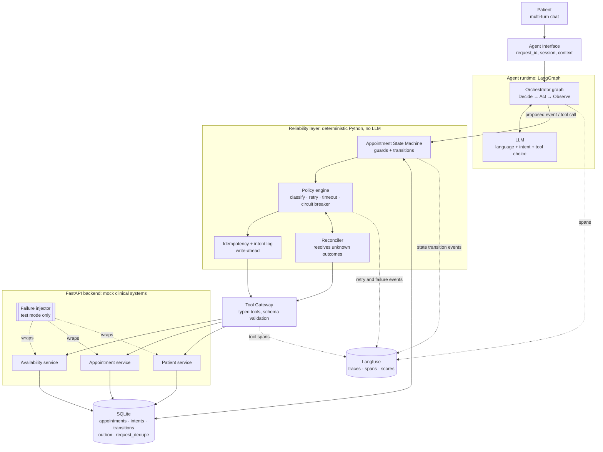
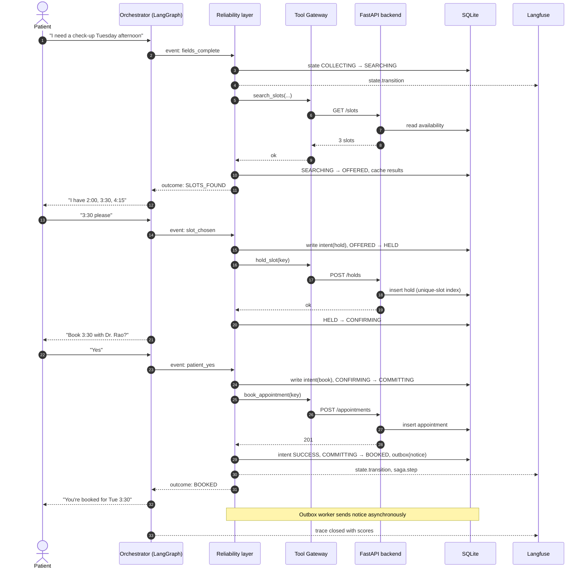
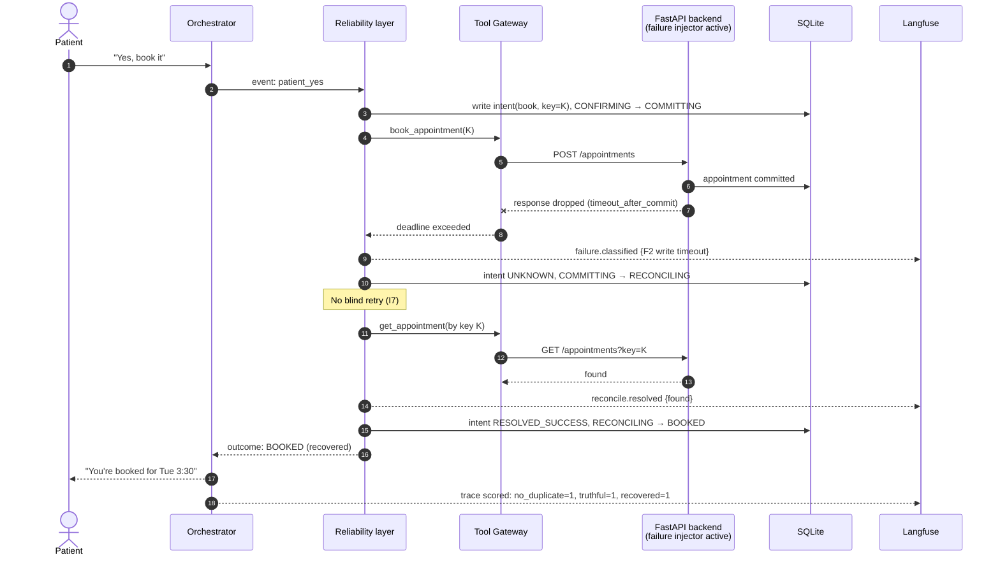
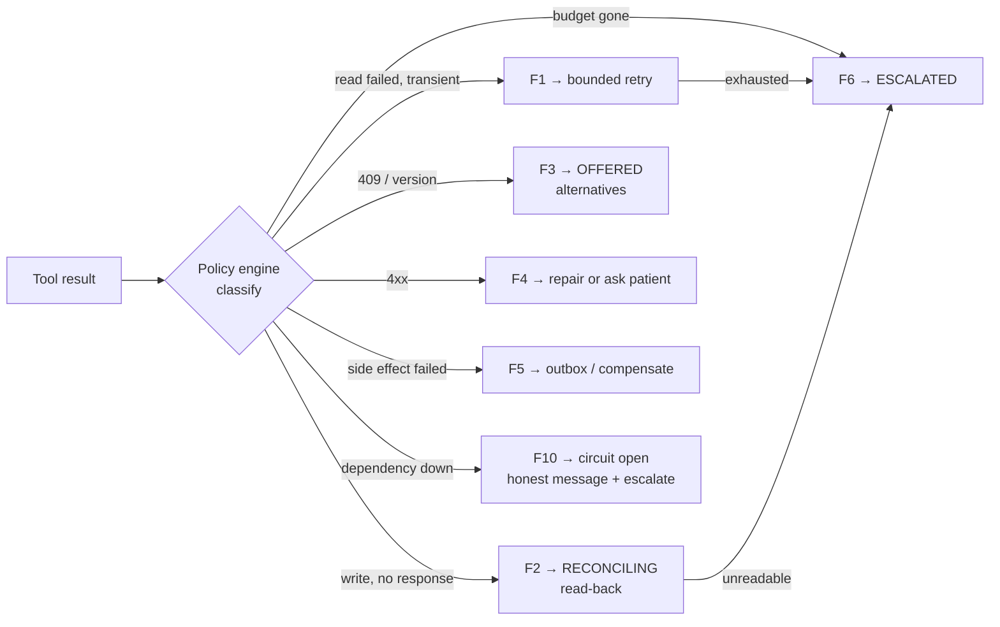
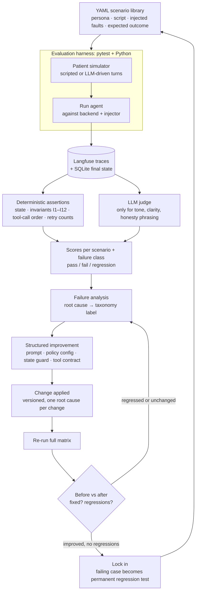

# System Design: Appointment Scheduling Agent

**Relationship to other documents**

| Document | Answers | Owns |
|---|---|---|
| [RELIABILITY_SPEC.md](RELIABILITY_SPEC.md) | *What must the system guarantee?* | States, transitions, failure classes (F1–F10), retry numbers, invariants (I1–I12) |
| **SYSTEM_DESIGN.md** (this file) | *How is it organised to guarantee that?* | Components, boundaries, data flow, responsibilities |
| Scenario matrix (next) | *How do we prove it?* | Scenarios, injections, assertions, scoring |

This file does **not** restate retry numbers, transition tables or failure rules. It refers to them by ID (e.g. T13, F2, I7).

---

## 1. Design stance

Three decisions shape everything else:

1. **The LLM proposes, deterministic code disposes.** The agent chooses *what to try*. The state machine, reliability layer and database decide *what is allowed* and *what is true*.
2. **Reliability lives in one layer, not in prompts.** Retry, timeout, idempotency and classification sit between the orchestrator and the tools. Prompts never carry retry logic.
3. **Observability is the evaluation substrate.** The evaluator reads Langfuse traces and the SQLite state. It does not scrape chat transcripts.

Not built, by choice: our own tracing framework, agent framework or UI. Langfuse, LangGraph and plain pytest cover those.

---

## 2. Diagram 1: High-level architecture



### Component responsibilities

| Component | Responsible for | Explicitly **not** responsible for |
|---|---|---|
| **Agent Interface** | Attaches `request_id`, session and patient context; transport-level dedupe (Reliability §4.4, transport layer) | Any decision-making |
| **Orchestrator (LangGraph)** | Conversation flow, slot filling, choosing the next tool, composing replies | Retrying, deciding what is true, writing state directly |
| **LLM** | Natural language, intent extraction, tool selection | Claiming outcomes (I3), setting state |
| **State Machine** | Validating every transition. Rejects illegal ones (F9) | Calling tools |
| **Policy engine** | Classifies each tool outcome into F1–F10 and applies the matching retry/timeout/circuit rule | Conversation |
| **Idempotency + intent log** | Writes the intent *before* the call, generates keys, replays duplicates (I2, I4) | Deciding whether to retry |
| **Reconciler** | Read-back after unknown outcomes (T15–T17, I7) | Making new bookings |
| **Tool Gateway** | Typed tool interface, argument schema validation, per-call deadline | Business rules |
| **FastAPI backend** | Mock Availability, Appointment and Patient services; enforces DB constraints (I1) | Knowing about the agent |
| **Failure injector** | Scripted faults per scenario (Reliability §8) | Production behaviour, since it is off outside test mode |
| **SQLite** | Single source of truth for appointment and intent state | Conversation memory |
| **Langfuse** | Traces, spans, events and scores. The only observability sink | Evaluation logic |

### Why the reliability layer sits *under* the orchestrator

The orchestrator never sees a raw timeout or a 503. It receives a **classified outcome** such as `UNKNOWN_OUTCOME`, `CONFLICT` or `RETRIES_EXHAUSTED`. Three consequences:

- Prompts stay small and don't drift. The LLM isn't asked to remember a retry policy.
- The same policy applies to every tool, so there is one place to test and to change.
- An agent that misbehaves cannot bypass the guarantees, because the guarantees are not in the agent.

---

## 3. Diagram 2: Normal booking sequence



**Design points**
- Every state change is written to SQLite and emitted to Langfuse. The two are meant to agree, and I10 checks that they do.
- The reply to the patient is generated **after** the outcome is known. The orchestrator can't say "booked" until the `BOOKED` outcome has been returned (I3).
- The confirmation notice is asynchronous. A notice failure never blocks or reverses a booking (Reliability §4.3).

---

## 4. Diagram 3: Failure and recovery sequence

The signature case is the **write that succeeded but whose response was lost** (scenario S3, class F2).



### How the other failure classes branch

This is the routing logic. The numbers and behaviour behind each branch are in the Reliability Spec.



**Design points**
- Classification is a pure function of (tool, status, error, state). That makes it unit-testable without an LLM.
- Every branch emits `failure.classified` and a recovery event, so a trace shows *why* the system took each path.
- Escalation always carries a context packet (I12).

---

## 5. Diagram 4: Evaluation → improvement → regression loop



### What each stage consumes and produces

| Stage | Input | Output |
|---|---|---|
| Scenario (YAML) | Failure class, persona, injected faults | Reproducible test case |
| Run | Scenario, agent version | Langfuse trace + SQLite snapshot, tagged with `scenario_id` and `agent_version` |
| Deterministic assertions | Trace + DB | Binary results, one per invariant and per scenario expectation |
| LLM judge | Final transcript only | Qualitative scores (tone, honesty of wording). **Never** used for state or correctness |
| Failure analysis | Failed trace | Root cause tagged with the failure taxonomy label |
| Improvement | Root cause | A single, scoped change recorded as a before/after record |
| Regression | Full matrix re-run | Delta report: fixed, still failing, newly broken |

The "regression proof" is the delta report from the same fixed scenario set, run against two agent versions, with injected faults held constant. Deterministic runs (seeded faults, temperature 0 where possible) keep that comparison meaningful. For LLM variance, each scenario runs N times and the pass rate is compared, not a single outcome.

---

## 6. Cross-cutting design

### Technology map

| Concern | Tool | Notes |
|---|---|---|
| Orchestration and agent state | LangGraph | The graph handles dialogue only. The lifecycle lives in the state machine module |
| Tracing and scoring | Langfuse | Single sink. Every event is in the Reliability Spec §7 |
| Backend and tools | FastAPI | Mock systems plus the failure injector |
| Persistence | SQLite | One file, transactional, with partial unique index for I1 |
| Evaluation | pytest + custom harness | One YAML file per scenario |
| Judging | LLM judge, narrow scope | Used only where assertions can't decide |

### Proposed code layout

```
/agent         langgraph graph, prompts, interface
/reliability   state_machine.py, policy.py, idempotency.py, reconciler.py
/gateway       tools.py (typed), schemas.py
/backend       FastAPI app, models, injector.py
/storage       schema.sql, db.py
/eval          scenarios/*.yaml, harness.py, assertions.py, judge.py, report.py
/docs          RELIABILITY_SPEC.md, SYSTEM_DESIGN.md
```

`/reliability` must not import from `/agent`. The dependency runs one way: agent → reliability → gateway → backend. That keeps the guarantees testable with no LLM involved.

### Trace identity

Each run carries `trace_id`, `scenario_id`, `agent_version`, `appointment_id` and `request_id`. These make three things possible: filtering by failure class in Langfuse, comparing versions in the regression report, and joining a trace to its SQLite rows.

### Deliberate simplifications

- **One patient session, one appointment in flight.** Multi-appointment concurrency is out of scope.
- **Single-process SQLite.** Concurrency conflicts are simulated by the injector. Real distributed contention is not modelled.
- **Synchronous outbox worker** in tests, so that notice failures are deterministic.

---

## 7. Traceability: from guarantee to proof

| Reliability guarantee | Component that enforces it | Where it is proven |
|---|---|---|
| No double booking (I1) | SQLite unique index | Scenarios S2, S7 |
| No blind write retry (I7) | Policy engine and Reconciler | S3, S4 |
| Truthful claims (I3) | Reply generated after the outcome, plus a claim checker | S3, S6, S9 |
| Bounded retries (I11) | Policy engine | S5, S10 |
| Idempotent replay (I2) | Intent log and backend | S3, S7 |
| Illegal transitions rejected (F9) | State machine | Unit tests plus S8 |
| Complete escalation packet (I12) | Escalation handler | S9, S10 |

Scenario IDs refer to the candidate list in Reliability §9. The scenario matrix will formalise them.
